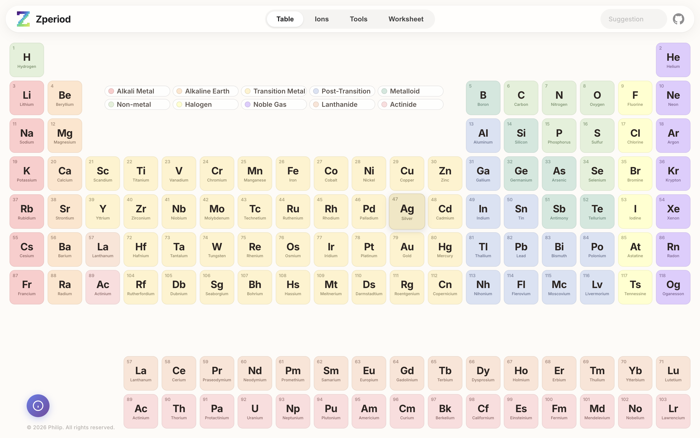
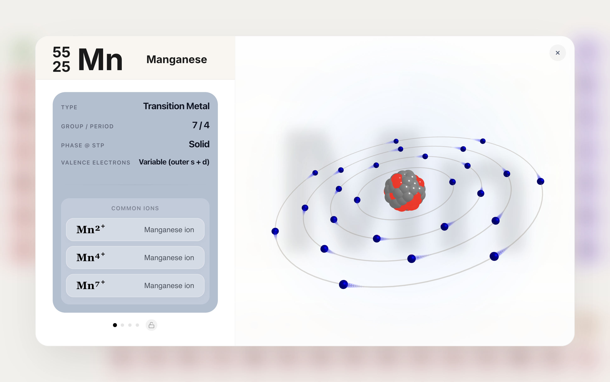
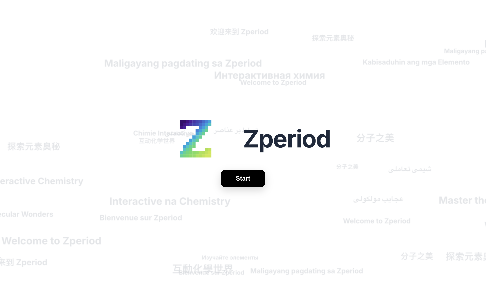
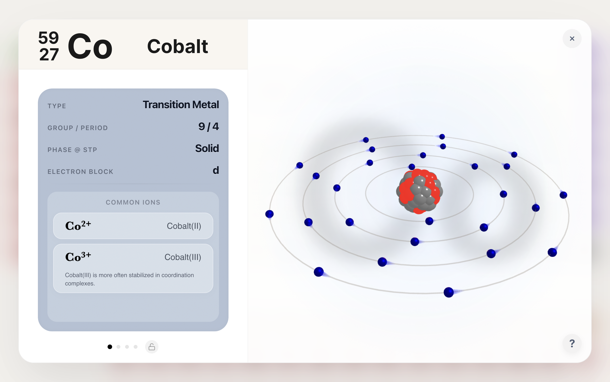
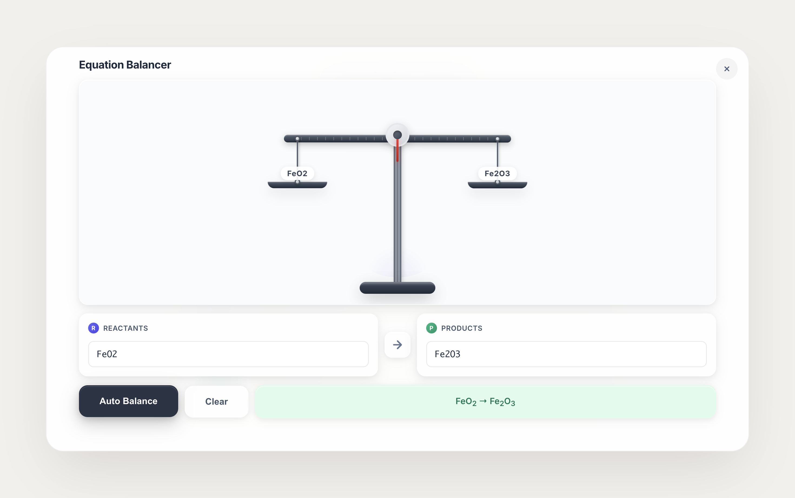
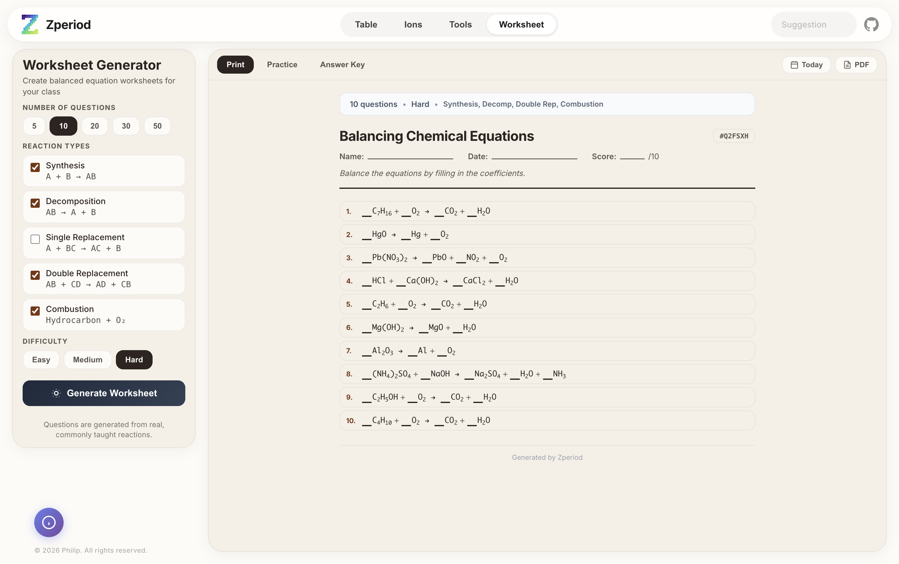

# 🧪 Leo'sPhysics

<div align="center">

**An Interactive Periodic Table for Chemistry Students**

[](https://developer.mozilla.org/en-US/docs/Web/JavaScript)
[](https://www.w3.org/Style/CSS/)
[](https://developer.mozilla.org/en-US/docs/Web/HTML)

_Master Chemistry. Visually & Instantly._

</div>

---

## ✨ Features

### 🔬 Interactive Periodic Table

- **118 Elements** with detailed information
- Click any element to view comprehensive data
- Smooth 3D atom visualization with electron shells
- Category-based color coding (Alkali Metal, Noble Gas, etc.)

### ⚡ Ion Engine

- **Monatomic & Polyatomic Ions** database
- Custom animations for each ion's properties
- Visual hints for flame tests, solubility, and more
- Real-time charge calculations

### 🛠️ Chemistry Tools

| Tool                              | Description                                            | Grade Level |
| --------------------------------- | ------------------------------------------------------ | ----------- |
| **Equation Balancer**             | Balance chemical equations with step-by-step solutions | 9-12        |
| **Molar Mass Calculator**         | Calculate molar mass with element breakdown            | 10-11       |
| **Empirical & Molecular Formula** | Derive formulas from mass data                         | 10-11       |
| **Solubility Table**              | Quick reference for ionic compounds                    | 9-12        |

---

## 🆕 Recent Updates (April 2026)

- Mobile-first landing refreshed with softer background motion text stream.
- Mobile landing no longer triggers desktop onboarding/welcome flow.
- Element modal export/download button was removed.
- Custom mobile assets were organized into the `images/` folder:
  - `images/mobile-bg-1.png`
  - `images/mobile-atom-2.png`

### 📝 Worksheet Generator

- Generate balanced equation practice problems
- Multiple reaction types (Synthesis, Decomposition, Combustion, etc.)
- Adjustable difficulty levels
- Print-ready PDF export

### ⌨️ Keyboard Navigation

- **Arrow Keys** (← →) - Navigate between info slides
- **Space Bar** - Next slide
- Fully accessible modal navigation

---

## 🚀 Quick Start

### Local Development

```bash
# Clone the repository
git clone https://github.com/leopantsulaia/physics-flex.git

# Navigate to project directory
cd physics-flex

# Install dependencies
npm install

# Start dev server (with hot reload)
npm run dev
```

### Quality Checks

```bash
# Lint + syntax check + production build
npm run check
```

### Production Build

```bash
# Build static files to dist/
npm run build

# Preview production build locally
npm run preview
```

---

## 📁 Project Structure

```
physics-flex/
├── .github/workflows/ci.yml # CI pipeline
├── package.json            # Vite scripts and dependencies
├── index.html              # Main HTML file
├── script.js               # Main JavaScript logic
├── three.min.js            # Legacy local Three.js copy
├── logo.svg                # Project logo
├── public/                 # Static files copied directly by Vite
├── css/
│   ├── base.css            # Design tokens, layout, navigation
│   ├── grid.css            # Periodic table grid
│   ├── modal.css           # Element detail modals
│   ├── tools.css           # Chemistry tools styles
│   ├── ions.css            # Ion engine styles
│   ├── ion-animations.css  # Ion-specific animations
│   ├── mobile-landing.css  # Mobile landing page
│   └── worksheet-styles.css
├── js/
│   ├── ion-animations.js   # Ion animation logic
│   ├── worksheet-generator.js
│   ├── data/
│   │   ├── elementsData.js # Element database
│   │   └── ionsData.js     # Ion database
│   └── modules/
│       ├── chemistryTools.js
│       ├── ionsController.js
│       ├── threeRenderer.js
│       └── uiController.js
├── images/                 # Preview screenshots
└── README.md
```

---

## 🎨 Design Philosophy

Leo'sPhysics follows modern design principles:

- **Minimal & Clean** - Inspired by Apple's design language
- **Glassmorphism** - Subtle frosted glass effects
- **Responsive** - Works on all screen sizes
- **Dark/Light Friendly** - Neutral color palette
- **Micro-animations** - Smooth, delightful interactions

---

## 🎓 Target Audience

- **Grade 9-12 Chemistry Students**
- **AP Chemistry / IB Chemistry**
- **Teachers** looking for classroom tools
- **Anyone** interested in chemistry visualization

---

## 📸 Screenshots

<details>
<summary>Click to expand screenshots</summary>

### Periodic Table View

_The main interactive periodic table with category legends_



### Element Detail Modal

_Comprehensive element information with 3D atom model_



### Mobile Welcome Stream Style

_Subtle multilingual background stream style used on the mobile-first landing experience_



### Mobile Atom Card Visual

_Custom Atom Models card visual used in the mobile landing feature preview_



### Equation Balancer

_Balance chemical equations with real-time scale visualization_



### Worksheet Generator

_Generate print-ready balanced equation worksheets_



</details>

---

## 🛡️ License

© 2026 Leo'sPhysics. All rights reserved.

This project is created for educational purposes. Unauthorized copying, modification, or redistribution without explicit permission is prohibited.

---

## 🙏 Acknowledgments

- **Three.js** - 3D graphics library
- **Google Fonts (Inter)** - Typography
- **The Chemistry Community** - For inspiration

---

<div align="center">

**Built with ❤️ and lots of ☕**

_Stop memorizing — start visualizing._

[](https://buymeacoffee.com/leosphysics)

</div>
